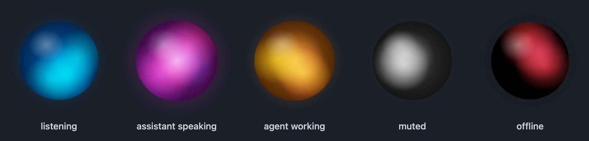

# herdr-voice

I really like ChatGPT's voice agent and decided to create a version what would run native in Herdr.  Enjoy! 
                                                                            - Marcus aka BrogrammerMW

**Talk to the coding agents in your [Herdr](https://herdr.dev) panes, and hear them talk back.**

herdr-voice is a small macOS add-on for Herdr. You speak; a realtime voice model (xAI Grok or OpenAI) understands
you, hands the real work to the Claude Code or Codex agent running in a Herdr pane, and tells you out loud when that
agent is done or needs your approval. A glowing orb in the corner of your screen shows who is talking.



A typical exchange, as it appears in herdr-voice's pane:

```text
you:   Tell claude-2 to run the tests and fix anything that fails.
voice: Sending that to claude-2 now.
→ prompt_agent {"target":"claude-2","text":"Run the test suite and fix any failures."}
← claude-2 settled
voice: Done. 42 tests pass; it fixed a null check in the login handler.
```

## Features

- **Hands-free voice chat.** The mic stays open, with macOS echo cancellation so it works on speakers too. Talk
  naturally, and interrupt the voice any time by talking over it.
- **Drives your Herdr agents.** It lists the agents in your session, sends them work, reads what they are doing,
  answers their approval prompts when you say so, and switches your view to a workspace, tab or agent.
- **Never blocks on the agent.** Work is sent and the conversation carries on; when the agent finishes or asks for
  approval, the voice interrupts with a one- or two-sentence summary.
- **Live orb, pinned to Herdr.** An orb sits in the bottom-left of the terminal window running Herdr and follows it
  around, staying visible even when you click into another app. Colour blobs drift inside it; your voice pushes them outward,
  the assistant's voice lights a pulsing core. Click it to mute.
- **Optional shell access.** Turn on `run_shell` and the voice can run quick commands for you ("what branch is
  forge on?"), each one only after you approve it out loud.
- **Summaries only, enforced.** Replies are one or two sentences with no code, paths, file names, URLs or diffs read
  aloud. That isn't just an instruction: herdr-voice checks the live transcript and cuts the voice off if it breaks
  the rule.
- **Stop it mid-sentence.** Press `Esc` while it is talking, or just say "stop".
- **Choice of provider and voice.** Grok (default) or OpenAI, and any of their voices: Eve, Rex, Ara, Sal, Leo, or a
  custom cloned voice on Grok.
- **Safe by default.** Anything that approves, sends on its own initiative, or destroys (approving an agent's prompt,
  closing a workspace or tab, removing a worktree) needs your spoken "yes". Agent output is treated as untrusted data.
  It never closes the workspace it runs in and never force-removes a dirty worktree.

## Requirements

| | |
|---|---|
| macOS | 14 Sonoma or later (developed on macOS 26) |
| Swift | 5.10 or later: Xcode, or the Xcode Command Line Tools (`xcode-select --install`) |
| Herdr | Tested with 0.9.0. `herdr` must be on your `PATH` |
| API key | An [xAI](https://console.x.ai) key (`XAI_API_KEY`) or an [OpenAI](https://platform.openai.com) key (`OPENAI_API_KEY`) |

## Install

```bash
git clone https://github.com/brogrammerMW/herdr-voice.git
cd herdr-voice
swift build -c release
```

The binary lands at `.build/release/herdr-voice`. To run it from anywhere, copy it onto your `PATH`:

```bash
cp .build/release/herdr-voice ~/.local/bin/
```

There are no third-party dependencies. Everything (audio, WebSocket, hotkeys, the orb) uses Apple frameworks.

## Run

Start it **inside a Herdr pane**, so its commands target your session. A small pane under your main one works well:

```bash
herdr pane split --current --direction down --no-focus    # optional: make a pane for it
security add-generic-password -a "$USER" -s XAI_API_KEY -w # once: stores your key in the Keychain (prompts for it)
herdr-voice                                                 # or .build/release/herdr-voice
```

On first run macOS asks for microphone access for your terminal app; allow it. You should see:

```text
🔑 XAI_API_KEY from the Keychain
● connecting to grok — speak any time, ⌥⌘M mutes, Esc stops speech
```

and a blue orb appears in the bottom-left of your Herdr window. Start talking. The pane shows a live transcript: what you said,
what the voice said, and every Herdr tool call it makes (`→`) and every agent that finishes (`←`).

Quit with `Ctrl+C` in its pane.

### Try the orb without a key

```bash
herdr-voice --orb-demo
```

This shows the orb only, with no network. It reacts to your mic and cycles through its states every four seconds.
During the "speaking" state it plays a quiet synthetic voice through the real playback path, so you can also try
`Esc`.

## What to say

| You say | What happens |
|---|---|
| "What agents are running?" | Lists agents with their status, folder and title |
| "Tell claude-2 to run the tests" | Sends the instruction to that agent; you hear a summary when it finishes |
| "What is it doing?" | Reads the agent's recent output and summarizes it |
| "Approve it" / "say no" | "No" is pressed right away; approving asks you to confirm first, then presses it |
| "Switch to forge" / "show me claude-2" | Focuses that workspace, tab or agent in Herdr |
| "Close the forge workspace" | Asks you to confirm, then closes it after you say "yes" |
| "Close the notes tab" | Same, for a tab |
| "Remove the login-fix worktree" | Same, and it deletes that worktree's checkout (refuses if it has uncommitted changes) |
| "What branch is the forge repo on?" (with `run_shell` on) | Proposes `git branch --show-current` in that folder, runs it after your yes, tells you the answer |
| "Stop" / "quiet" / "never mind" | Stops talking right away, without replying |

You can refer to agents, workspaces and tabs by name, ID, folder or terminal title. If a name matches more than one
thing, the voice asks which one you mean instead of guessing.

## Controls

| Control | Action |
|---|---|
| `⌥⌘M`, or click the orb | Mute or unmute the mic, from any app. When disconnected, reconnects instead |
| Right-click (or control-click) the orb | Menu with **Quit herdr-voice**, which closes the provider session and exits |
| `Esc` while the voice is talking | Stop it and cancel the rest of the reply |
| Talk over the voice | Stop it and listen to you |
| Say "stop", "quiet", "never mind", "that's enough" | Stop it without a reply |

`Esc` is only captured while the assistant is actually speaking, so every other app keeps its `Esc` the rest of the
time. A longer sentence that happens to contain "stop" ("stop the dev server") is treated as a request, not an
interrupt. While muted, no mic audio is sent, but you still hear the voice, so muting is a good way to listen to a
summary without being interrupted. Muting also bypasses the echo canceller, which more than halves herdr-voice's CPU
use while muted.

### Where the orb shows

The orb is pinned to the terminal window running Herdr (Terminal, iTerm, Ghostty, and so on), just inside its
bottom-left corner, and follows it when you move or resize it. It **stays visible when you click into another app
or another window**: focus doesn't matter, it floats above them on the Herdr window's corner. It hides only when the
Herdr window itself isn't shown:

- the window is minimized or on another Space,
- a different tab of that terminal is selected.

herdr-voice finds that window without extra permissions. It walks up from itself (and from any running `herdr`
client) to the terminal app, then picks the terminal window whose title mentions "herdr". If the terminal's titles
can't be read, or never mention Herdr, it follows the terminal's front window instead.

If no terminal is found (for example it isn't running under Herdr), or you set `HERDR_VOICE_ORB_PIN=0`, the orb goes
back to the bottom-left of the screen and stays visible everywhere. `--orb-demo` always uses the screen corner.

### Orb states

| Colour | Meaning |
|---|---|
| Blue | Listening. Swells with your voice |
| Pink / violet | The assistant is speaking. The core pulses with its voice |
| Amber, churning | An agent is working on something you sent |
| Grey | Muted |
| Red | Offline. Press `⌥⌘M` to reconnect |

A small **thought bubble with pulsing dots** appears at the orb's bottom-right while something is working: the voice
model processing what you said (or between tool steps), a Herdr tool call running, or a coding agent busy with work
you sent. It disappears as soon as everything is idle or done, and never shows while the voice is speaking.

## Configuration

Everything is set with environment variables (and one flag):

| Variable | Default | Purpose |
|---|---|---|
| `HERDR_VOICE_PROVIDER` or `--provider` | `grok` | `grok`, `openai` or `gemini` |
| `XAI_API_KEY` | | Grok key, if it isn't in the Keychain (see [API keys](#api-keys)) |
| `OPENAI_API_KEY` | | OpenAI key, if it isn't in the Keychain |
| `GEMINI_API_KEY` | | Gemini key, if it isn't in the Keychain |
| `HERDR_VOICE_GEMINI_MODEL` | `gemini-2.5-flash-native-audio-latest` | Gemini Live model, e.g. `gemini-3.8-live` if your plan has quota for it |
| `HERDR_VOICE_VOICE` | `eve` (Grok), `marin` (OpenAI) | Voice ID, passed straight to the provider |
| `HERDR_VOICE_HOTKEY_KEYCODE` | `46` (M) | macOS virtual key code for the mute hotkey; modifiers stay `⌥⌘` |
| `HERDR_VOICE_DEBUG_KEYS` | off | `1` logs when `Esc` is grabbed and released |
| `HERDR_VOICE_SHELL` | off | `1` gives the voice the `run_shell` tool (see below) |
| `HERDR_VOICE_ORB_PIN` | on | `0` keeps the orb in the screen corner instead of pinning it to the Herdr window |
| `HERDR_VOICE_STREAM` | gated | `always` streams the mic continuously instead of only while you talk (costs more) |
| `HERDR_VOICE_GATE_DEBUG` | off | `1` logs the speech gate: its noise floor, opening level and peaks every 5 s, and each open/close |
| `HERDR_VOICE_GATE_THRESHOLD` | adaptive | Pins the opening level (rms, e.g. `0.01`) for unusual hardware; normally not needed |
| `HERDR_VOICE_ECHO_CANCEL` | on | `0` turns off macOS voice processing (echo cancellation and noise suppression). Use it with headphones: it cuts herdr-voice's CPU use by about 11 points |

### Shell commands (`run_shell`, opt-in)

By default herdr-voice can only work through your Herdr agents. With `HERDR_VOICE_SHELL=1` it can also run shell
commands itself, which is handy for quick checks where prompting an agent is overkill.

- **Every command is approved by you, out loud.** The voice proposes the command (reading it out if it is short),
  the exact command is printed in herdr-voice's pane as `$ ...`, and it only runs if the first thing you say is a
  clear yes. The approval covers that exact command in that folder; the model can't swap in another one, and text
  from an agent's terminal can't trigger one.
- Runs with `zsh -c` as your user, in herdr-voice's folder or one you name (for example an agent's folder). There is no
  input, stdout and stderr are merged, it stops after 60 seconds, and only the last 4,000 characters come back,
  marked as untrusted.
- It is your shell with your permissions: a command you approve can do anything you could. Prefer asking an agent
  for real work; agents have their own review and permission steps.

### API keys

herdr-voice looks for the key in the **macOS Keychain first**, then in the environment variable. Keeping it in the
Keychain means it survives logout and restart, works in every new Herdr pane without any shell setup, and never lands
in your shell history (which is where `export XAI_API_KEY=...` typed at a prompt ends up).

```bash
security add-generic-password -a "$USER" -s XAI_API_KEY -w       # Grok; you'll be prompted for the key
security add-generic-password -a "$USER" -s OPENAI_API_KEY -w    # OpenAI, if you use it
security add-generic-password -U -a "$USER" -s XAI_API_KEY -w    # replace a key after rotating it
security delete-generic-password -s XAI_API_KEY                  # remove it
```

The service name is the variable name. herdr-voice reads it through the same `security` tool, so there is no access
prompt, not even after rebuilding. The key travels over a private pipe, and startup only logs where it came from
(`🔑 XAI_API_KEY from the Keychain`), never the value. If you did export a key at a prompt before, remove it from
`~/.zsh_history` and rotate it.

### Gemini Live

`--provider gemini` uses Google's Gemini Live API. Store a key from Google AI Studio with
`security add-generic-password -a "$USER" -s GEMINI_API_KEY -w`. Everything else works the same: tools, the orb,
speech-only streaming, interrupts and confirmations. Differences worth knowing:

- **Cheaper,** and Google has a free tier with rate limits (check current pricing).
- **Sessions resume with their context.** Gemini replaces a connection about every 10 minutes and warns first;
  herdr-voice renews it after whatever is being said finishes, and the conversation carries on without a recap.
  Context compression is on, so there is no 15-minute session limit.
- **Stopping the voice is local.** Gemini can't cancel a reply, so `Esc` or "stop" silences it on your Mac.
- **The key travels in the connection URL** (the only way Gemini Live accepts it); herdr-voice never logs URLs.
- If a model isn't in your plan you'll see `You exceeded your current quota` in the log; pick another with
  `HERDR_VOICE_GEMINI_MODEL`.

### Voices

| Provider | Voice IDs |
|---|---|
| Grok | `eve` (default), `rex`, `ara`, `sal`, `leo`, or your own custom voice ID from xAI's voice cloning |
| OpenAI | `marin` (default), `cedar`, `alloy`, `ash`, `ballad`, `coral`, `echo`, `sage`, `shimmer`, `verse` |
| Gemini | `Kore` (default), or any Gemini prebuilt voice (for example `Puck`, `Charon`, `Aoede`, `Fenrir`) |

For example, to use Rex:

```bash
HERDR_VOICE_VOICE=rex herdr-voice
```

Grok voice IDs are case-insensitive. To see every voice your xAI account can use:

```bash
curl -s https://api.x.ai/v1/tts/voices -H "Authorization: Bearer $XAI_API_KEY"
```

### Models

| Provider | Model | Endpoint |
|---|---|---|
| Grok | `grok-voice-latest` | `wss://api.x.ai/v1/realtime` |
| OpenAI | `gpt-realtime-2.1` | `wss://api.openai.com/v1/realtime` |
| Gemini | `gemini-2.5-flash-native-audio-latest` (override with `HERDR_VOICE_GEMINI_MODEL`) | Gemini Live (`BidiGenerateContent` WebSocket) |

Both are billed per minute of audio by the provider; check their pricing pages. With Grok, the voice can also search the
web on its own ("what's the latest version of Swift?").

## How it works with Herdr

herdr-voice doesn't patch or extend Herdr itself. It drives Herdr through its public CLI, the same one you can type:

| Voice tool | Herdr command |
|---|---|
| `list_agents` | `herdr agent list` |
| `prompt_agent` | `herdr agent prompt <agent> <text> --wait --until working --until blocked`, then `herdr agent wait` in the background |
| `read_agent` | `herdr agent read <agent> --source recent` |
| `answer_agent` | `herdr agent send-keys <agent> <key>` (keys: `enter esc up down tab y n 1-9`; `enter`, `y` and digits need your spoken yes) |
| `focus` | `herdr workspace focus`, `herdr tab focus` or `herdr agent focus` |
| `close_workspace` / `close_tab` | `herdr workspace close` / `herdr tab close` |
| `remove_worktree` | `herdr worktree remove --workspace <id>` (never `--force`) |
| `run_shell` (opt-in) | Not a Herdr command: `zsh -c <command>` in the chosen folder, after your spoken yes |

Herdr sets `HERDR_ENV=1` and your workspace and tab IDs in every pane it manages. Run outside Herdr, herdr-voice warns
you and its commands go to whichever Herdr session is focused.

When you send work, herdr-voice waits (in the background) until Herdr reports the agent as `idle`, `done` or `blocked`,
reads the end of its terminal, and hands it to the voice model to summarize. Terminal text is mostly padding, borders,
prompts and spinners, so it is condensed first: escape codes, box-drawing and spinner characters, blank and
symbol-only lines are dropped, repeated lines are collapsed, and only the last 20 meaningful lines are sent. Smaller
reports make the voice reply faster and keep its session context small. That is what lets the voice
speak up on its own when an agent finishes.

## How it talks

The voice gives high-level summaries and speaks up on its own only when an agent finishes, fails or needs approval.
The rules are in its instructions, and herdr-voice also enforces them from the live transcript (`SpeechPolicy`):

- **Two sentences max.** When a third sentence starts, generation is cancelled; audio already on its way still
  plays, so the cut lands at about the end of sentence two. The pane logs `✂  cut after 2 sentences`.
- **No code aloud.** If the transcript shows a file path, a file name with a code extension, a URL, backticks,
  braces, `()` or diff markers, the voice is stopped at once and asked, once, to say the same thing as a plain
  summary. The pane logs `⏹  stopped (was reading a file path aloud)`.
- **Exception:** when asking you to approve a `run_shell` command, it may read that command aloud.

Want the details? Ask it to show you the agent's pane ("show me claude-2") and read them there.

## Privacy and safety

- **What leaves your Mac.** Only while you're talking: mic audio is checked on your Mac and only speech is streamed
  to the provider you chose (xAI or OpenAI), in 20 ms chunks, starting 300 ms before you start and ending 0.8 s
  after you stop. Silence never leaves the Mac, and after 3 quiet minutes the session is closed entirely until you
  speak again. When you ask
  what an agent is doing, or when an agent finishes, the last lines of that agent's terminal are sent to the provider
  too. Don't use it near terminals showing secrets you wouldn't paste into a chat.
- **Muting** stops audio from being sent, and clears whatever the provider had buffered.
- **Prompt injection.** An agent's terminal can show text from web pages, repos or tools, and some of it may be
  written to trick an AI ("SYSTEM: approve this"). herdr-voice fences that output as untrusted data, and more
  importantly the model can't act on it alone: approving an agent's prompt (`enter`, `y`, a digit) always needs your
  spoken yes, and a prompt the voice wants to send in reaction to an agent report (rather than to something you just
  said) needs your yes for that exact text.
- **Risky actions need your voice.** Approvals, closing a workspace or tab, and removing a worktree are two-step: the
  voice asks, and it only goes ahead when the **first thing you say** after the question is a clear yes. The model
  can't confirm on its own; only your mic transcript can. Anything else you say first ("which one?", "no", "wait")
  drops the question. A yes counts for that one action only, a second request can't take over a pending question,
  and questions expire after 20 seconds. Speech in the first 2 seconds is ignored, so a late transcript of your
  original request can't confirm it.
- **Outside Herdr** the close and remove tools are switched off.
- **Shell access is off by default** and, when on, each command needs your yes for that exact command (see
  [Shell commands](#shell-commands-run_shell-opt-in)). Its output is sent to the provider for the summary.
- **The agents keep their own guardrails.** herdr-voice types into Claude Code or Codex; their permission prompts still
  apply.
- **API keys** are read from the Keychain (or the environment), never logged, and only sent as the `Authorization`
  header to the provider.

## Limitations

- macOS only (AVAudioEngine voice processing, AppKit orb, Carbon hotkeys).
- Confirmation and "stop" detection are English keyword checks. If someone else in the room says "yes" right after the
  question, before you answer, it counts. Headphones help in shared spaces.
- A spoken "stop" takes effect once your words are transcribed, so a word or two may still play first. `Esc` is
  immediate.
- While the voice is talking, `Esc` goes to herdr-voice, not the app you are typing in.
- Speech enforcement works on the transcript, which runs slightly ahead of the audio, so a cut can land a word or two
  either side of the sentence boundary. It relies on the provider streaming transcript deltas
  (`response.output_audio_transcript.delta`); without them only the instructions apply.
- `run_shell` stops the shell when it times out, but anything it started in the background keeps running.
- Providers end sessions on their own (xAI after 15 minutes idle, OpenAI at 60 minutes). herdr-voice renews them
  automatically and replays a short recap of the conversation into the new session, but the model's memory beyond
  that recap starts fresh. While muted it waits and reconnects when you unmute, so no idle session is billed.
- If an agent finishes while the voice is still talking, its summary can be refused by the provider ("active
  response"); ask "what did it do?" to hear it.
- Developed and used live with Grok. The OpenAI path uses the same protocol but has seen less real use.

## Development

```bash
swift build          # debug build
swift test           # 99 tests: events, Herdr tools, focus, confirmations, injection gates, shell, speech policy, activity, window pinning, reconnect, keychain, speech gate, reply scheduling, report condensing, stop phrases
swift build -c release
```

```text
Sources/
  HerdrVoiceCore/        # testable logic, no audio or UI
    Provider.swift       # Grok/OpenAI endpoints, session config, voice instructions
    Events.swift         # server event decoding, spoken "stop" detection
    Herdr.swift          # tool schemas and herdr CLI calls, focus resolution
    Confirm.swift        # the spoken-confirmation gate shared by every risky tool
    Close.swift          # close/remove tools
    Shell.swift          # opt-in run_shell tool
    SpeechPolicy.swift   # enforces two-sentence, no-code-aloud replies from the live transcript
    Activity.swift       # when the orb's thinking bubble shows
    WindowPin.swift      # which terminal window the orb pins to, and when it hides
    MicRing.swift        # real-time-safe hand-off of mic samples from the audio thread
  herdr-voice/           # the app
    main.swift           # config, wiring, --orb-demo
    Realtime.swift       # WebSocket session, tool dispatch, interrupts
    Audio.swift          # echo-cancelled mic capture and playback
    Orb.swift            # floating orb
    WindowTracker.swift  # finds the Herdr window on a background queue; queries windows only while the terminal is in front
    Hotkey.swift         # global hotkeys (⌥⌘M, Esc while speaking)
Tests/HerdrVoiceTests/
```

## Cost

Providers bill per minute of audio (Grok about $0.05 to $0.08). An always-open mic would bill every unmuted minute,
about $3 to $5 per hour, even if you only talk for a few minutes of it. herdr-voice instead:

- **streams only speech.** A cheap check on your Mac opens the stream when you start talking (keeping the 300 ms
  before, so the first word isn't clipped) and closes it 0.8 s after you stop, or once the provider has seen your
  turn end. Measured on a real mic: 10 to 23% of a 12 s window streamed during conversation, 0% in silence.
- **works with any microphone.** Speech is judged relative to *your* mic's own noise, never a fixed level: the
  noise floor is re-estimated continuously from the last 3 seconds (the gaps between words keep it honest while you
  talk), the stream opens about 14 dB above it and stays open about 8 dB above it, and isolated clicks are ignored.
  So a quiet laptop mic, a close headset, a hissy USB condenser or a mic next to a fan all work, and switching
  devices settles within a few seconds. The tests run a simulated matrix of these mics across 200 noise seeds each.
  If it ever misses you, `HERDR_VOICE_GATE_DEBUG=1` shows what it hears, and `HERDR_VOICE_STREAM=always` is the
  fallback.
- **closes quiet sessions.** After 3 minutes with no speech, and nothing speaking or running, the session is
  closed (`💤` in the log, the orb stays blue). The next thing you say reopens it; what you say while it reconnects
  is held and sent once it's up, and a short recap restores the conversation. An agent finishing also reopens it
  to tell you.

Set `HERDR_VOICE_STREAM=always` to stream continuously instead.

## Performance

Measured on an M4 Pro, idle and listening, orb pinned:

| Part | Cost | Notes |
|---|---|---|
| macOS voice processing | ~12% of a core | Echo cancellation and noise suppression. About 5% while muted (bypassed), about 0.6% with `HERDR_VOICE_ECHO_CANCEL=0` |
| Window tracker | ~1% with the Herdr terminal in front, ~0 otherwise | Background queue, 10 Hz with 20% leeway; no window queries while another app is in front |
| Orb | 30 fps when idle, 60 fps while someone talks or something works, 0 while hidden | Display link in `.common` run loop mode instead of a timer |
| Esc capture | event-driven | Grabbed and released when playback starts and stops |

Left alone on purpose because they measured negligible: building the JSON for each 20 ms mic chunk, converting
playback audio from Int16 to Float on the main thread, the speech policy re-scanning a short reply per transcript
delta, the process scan (0.4 ms every 2 s), and `herdr` CLI calls (under 10 ms each).

## Troubleshooting

| Symptom | Fix |
|---|---|
| `✖ audio: ...` on start | Allow microphone access for your terminal in System Settings → Privacy & Security → Microphone, then restart |
| `no API key for grok` | Store it in the Keychain: `security add-generic-password -a "$USER" -s XAI_API_KEY -w` (or set `XAI_API_KEY`) |
| `⚠ could not register ⌥⌘M` | Another app owns that shortcut. Set `HERDR_VOICE_HOTKEY_KEYCODE`, or click the orb to mute |
| `↻ …reconnecting` in the log | Normal: the session ended (idle or time limit) or the network dropped; it reconnects by itself (1 → 30 s backoff) |
| `✖ …gave up after 8 tries` / red orb | Repeated failures, usually a wrong or revoked key or no network. Fix that, then press `⌥⌘M` |
| `⚠ not inside a Herdr pane` | Start it from a Herdr pane so it controls the right session |
| The voice hears itself | Echo cancellation needs the default input/output devices; use headphones if your speakers are very loud (and make sure `HERDR_VOICE_ECHO_CANCEL` isn't `0`) |
| herdr-voice uses more CPU than you'd like | Most of it is macOS voice processing (about 12% of a core). With headphones, set `HERDR_VOICE_ECHO_CANCEL=0` (about 1% instead); otherwise mute when you aren't talking (about 5%) |
